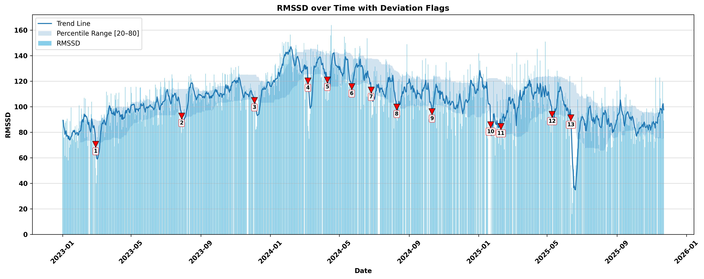

# 1000 Days of HRV

This repository contains the data and analysis code for the manuscript:

**1000 Days of HRV: A Case Study of Daily Post-Wake-Up Heart Rate Variability for Tracking Stressful Life Events**

Pre-print: **[LINK TO PRE-PRINT]**

## Overview

This project reports a single-participant (myself!) longitudinal case study of daily post-wake-up heart rate variability (HRV) recorded over 1,000 days. The main goal was to examine whether brief, standardized morning HRV measurements can capture meaningful within-person physiological deviations that correspond to stressful life events or impactful periods.

The raw data-processing steps from the different devices/apps have already been completed, and the resulting dataset is provided as a single CSV file.

## Data

The main dataset is stored as: `data.csv` file.

The `combined` variable contains all the merged data used for the main analyses.

Each row corresponds to one calendar day. The date range is linear, so days without a given recording remain present in the dataset as missing values.

## Variables in `data.csv`

| Variable                | Description                                                                                                     |
| ----------------------- | --------------------------------------------------------------------------------------------------------------- |
| `date`                  | Calendar date.                                                                                                  |
| `duration_s_cardio`     | Total duration of cardio training sessions on that day, in seconds.                                             |
| `duration_s_not_cardio` | Total duration of non-cardio training sessions on that day, in seconds.                                         |
| `avg_hr_cardio`         | Average heart rate during cardio training sessions on that day.                                                 |
| `avg_hr_not_cardio`     | Average heart rate during non-cardio training sessions on that day.                                             |
| `calories_cardio`       | Estimated calories from cardio training sessions on that day.                                                   |
| `calories_not_cardio`   | Estimated calories from non-cardio training sessions on that day.                                               |
| `night_rmssd`           | Nocturnal RMSSD obtained from the Polar Grit X Pro nightly recovery export.                                     |
| `mean_hr`               | Mean heart rate during the post-wake-up resting-state recording.                                                |
| `mean_hp`               | Mean heart period during the post-wake-up resting-state recording.                                              |
| `sdnn`                  | Standard deviation of normal-to-normal intervals from the post-wake-up recording.                               |
| `rmssd`                 | RMSSD from the post-wake-up recording; this is the main HRV variable used in the manuscript.                    |
| `pnn50`                 | Percentage of successive heart-period differences greater than 50 ms.                                           |
| `rec_source`            | Source of the post-wake-up HRV recording: HRV4Training, HRV Logger, or CameraHRV.                               |
| `artifact`              | Number of detected artifacts in the HRV Logger recording, when raw heart-period data were available (i.e., when recorded via the HRV Logger app).            |
| `rmssd_1min`            | RMSSD computed from the first minute of the HRV Logger recording (post-wake up measurement), used for the 1-minute vs 2-minute comparison. |
| `log_category`          | Broad diary/event category for noteworthy events.                                                               |
| `log_specific`          | More specific diary/event note for contextual interpretation.                                                   |
| `log_rmssd`             | Natural-log-transformed post-wake-up RMSSD.                                                                     |
| `log_night_rmssd`       | Natural-log-transformed nocturnal RMSSD.                                                                        |

## Analysis

The analyses in this repository reproduce the main results reported in the manuscript, including:

1. identification of downward deviations from the individual post-wake-up RMSSD reference range;
2. comparison of 1-minute and 2-minute post-wake-up RMSSD recordings;
3. comparison of post-wake-up and nocturnal RMSSD;

## Citation

If you use this repository, please cite the manuscript:

> Sinichi, A., & Krabbendam, L., Gevonden, M.
> *1000 Days of HRV: A Case Study of Daily Post-Wake-Up Heart Rate Variability for Tracking Stressful Life Events.*
> Pre-print: [LINK TO PRE-PRINT]

## Contact

For questions about the manuscript or repository, contact:

**Amin Sinichi**
[m.sinichi@vu.nl](mailto:m.sinichi@vu.nl)
[aminsinichi@gmail.com](mailto:aminsinichi@gmail.com)